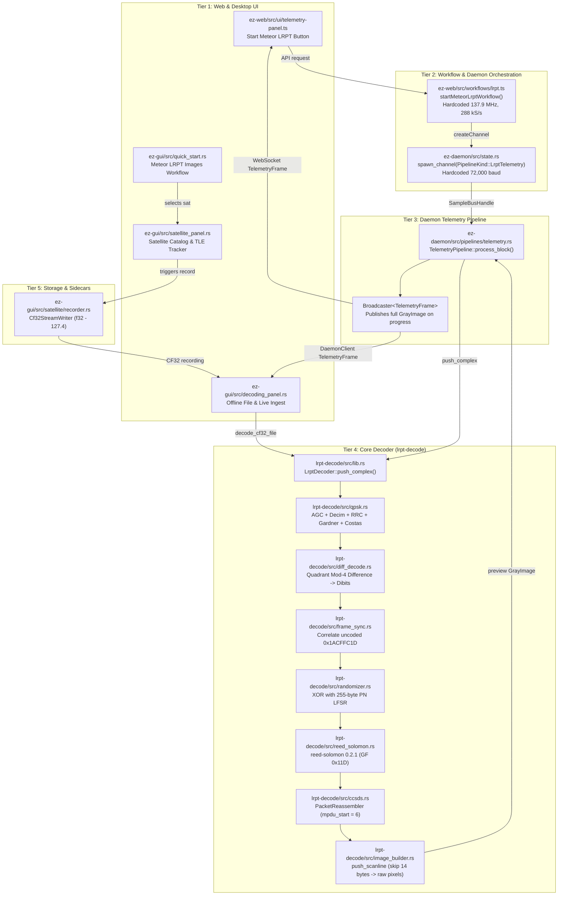

# Meteor LRPT Documentation & Implementation Audit Report

**Audit Date:** 2026-09-18  
**Harness / Model:** Codex-agy / Gemini 3.6 Flash (high reasoning)  
**Target Repository:** `/home/lupc/Documents/ez-sdr`  
**Scope:** Meteor-M2 Family LRPT Downlinks, Telemetry Pipelines, RF Frequencies, TLE / Doppler, Framing, Cryptography / Channel Coding, Image Reconstruction, and User-Facing GUI / Web Workflows.

> **Current-tree resolution (2026-09-20):** The findings below are the historical, pre-fix audit and must not be read as a description of the current decoder. The protocol layers that were called fatal are now implemented and covered by focused regressions.

| Original finding | Current-tree resolution |
|---|---|
| Missing convolutional decoder and wrong receive order | Added CCSDS K=7, rate-1/2 Viterbi decoding with 171/133 octal generators; receive order is Viterbi, optional NRZ-M, then CADU sync. The coded ASM is checked against `0xFCA2B63DB00D9794`. |
| Incompatible generic Reed-Solomon crate | Replaced with native CCSDS RS(255,223), polynomial `0x187`, first root 112, primitive element 11, and four-way interleaving; an independent libfec parity vector is included. |
| Missing OQPSK handling | Added half-symbol Q reconstruction and eight phase/axis hypotheses. Workflows default to 80 ksym/s while the API remains configurable for 72 ksym/s recordings. |
| VCDU insert-zone offset | VCDU bytes 6–7 are treated as the insert zone, the M-PDU starts at byte 8, and realistic packet-placement regressions cover the layout. |
| Raw treatment of MSU-MR JPEG data | Added Huffman decoding, quantization, IDCT, MCU reconstruction, and 1568-pixel scanline assembly. |
| Dead spacecraft and incomplete web workflow | Active Meteor-M2-3/M2-4 presets and frequencies are used by desktop and web workflows. |
| Synthetic orbit and disruptive Doppler retuning | Satellite state now comes from parsed TLE/SGP4 propagation, and the Satellite panel imports current 2LE/3LE files by NORAD ID. Doppler is displayed from observer-relative range rate while LRPT hardware remains at nominal center frequency so the Costas loop can track smoothly. |

The material validation limit is now the absence of a checked-in, independently sourced off-air IQ capture with a known decoded image. Passing unit/regression vectors establish layer behavior but do not substitute for an end-to-end RF field test. The detailed historical analysis below remains as the evidence trail for the fixes.

---

## 1. Executive Finding

A deep, evidence-based, read-only audit of the Meteor LRPT subsystem in `ez-sdr` (`lrpt-decode/src/**`, `ez-daemon/src/pipelines/telemetry.rs`, `ez-gui/src/decoding_panel.rs`, `satellite/**`, `satellite_panel.rs`, `tle_engine.rs`, `frequency_db.rs`, `quick_start.rs`, `ez-web/src/workflows/lrpt.ts`, `ez-web/src/ui/telemetry-panel.ts`, tests, and `README.md`) reveals that **the current Meteor LRPT implementation cannot decode any genuine on-air Meteor-M2-3 or Meteor-M2-4 satellite transmission**.

While the codebase presents a complete, elegant facade from UI controls to demodulation, frame synchronization, and progress meters, the signal processing and decoding chain contains **five fatal architectural defects** that break compatibility with physical reality:

1. **Complete Absence of Convolutional / Viterbi Decoding (Layer 1):** Real Meteor-M2 series satellites transmit an inner rate $r = 1/2, K = 7$ convolutional code over OQPSK/QPSK. `lrpt-decode` completely lacks a Viterbi decoder. Demodulated symbols are sliced directly into dibits and searched for the 32-bit CADU Attached Sync Marker (`0x1ACFFC1D`). On real signals, the ASM is convolutionally encoded into 64 channel bits (`0xFCA2B63DB00D9794`); the uncoded 32-bit ASM never appears in the demodulated bitstream. CADU frame sync can never lock on genuine RF captures.
2. **Mathematically Incompatible Reed-Solomon Codec (Layer 2):** The crate dependency [`reed-solomon = "0.2.1"`](file:///home/lupc/Documents/ez-sdr/lrpt-decode/Cargo.toml#L18) implements generic QR-code Reed-Solomon over Galois Field polynomial $0x11D$ ($x^8 + x^4 + x^3 + x^2 + 1$) with consecutive roots of $\alpha^1$ starting at 0. CCSDS 131.0-B §4 mandates Galois Field polynomial $0x187$ ($x^8 + x^7 + x^2 + x + 1$) and generator roots $\alpha^{11j}$ ($j = 112 \dots 143$). The crate cannot correct or validate genuine CCSDS RS(255,223) codewords.
3. **Omission of the 2-Byte VCDU Insert Zone (Layer 3):** Under CCSDS AOS / Meteor framing, CADU frames contain a 2-octet VCDU Insert Zone between the 6-byte VCDU Primary Header and the 2-byte M-PDU Header. `lrpt-decode` hardcodes `mpdu_start = 6` instead of 8 (or CADU byte 12). It parses the Insert Zone as the M-PDU header and starts extracting Space Packets 2 bytes early. All Space Packet headers are misaligned, yielding invalid APIDs and lengths.
4. **Bypassing JPEG MCU Decompression (Layer 4):** Meteor MSU-MR instruments transmit 8x8 Discrete Cosine Transform (DCT) Minimum Coded Units (MCUs) compressed with JPEG Huffman entropy coding and quality-factor scaled quantization tables. [`lrpt-decode/src/image_builder.rs`](file:///home/lupc/Documents/ez-sdr/lrpt-decode/src/image_builder.rs#L87-L95) skips 14 bytes and treats the remaining variable-length Huffman bitstream as raw 8-bit uncompressed raster pixels. Even if a frame were decoded, the rendered output would be static noise, not satellite imagery.
5. **Rigid Modulation and Rate Assumptions (Layer 0):** Both active spacecraft (Meteor-M2-3 and Meteor-M2-4) use Offset QPSK (OQPSK), not standard QPSK, and Meteor-M2-4 has operated at 80 kbaud (80,000 sym/s). The decoder only supports standard QPSK at 72,000 sym/s.

All 68 unit tests in `lrpt-decode` pass only because the test suite is **strictly circular**: test fixtures are synthesized by a helper ([`build_synthetic_iq_stream`](file:///home/lupc/Documents/ez-sdr/lrpt-decode/src/lib.rs#L435-L450)) that encodes artificial data using the exact same non-standard parameters (no convolutional coding, wrong RS polynomial, no Insert Zone, raw pixel arrays).

Furthermore, database entries, bookmarks, TLE catalogs, and UI descriptions cite defunct spacecraft (Meteor-M2 and Meteor-M2-2), omit active spacecraft (Meteor-M2-3 and Meteor-M2-4), and provide conflicting frequency recommendations.

---

## 2. End-to-End Trace

The current runtime path for Meteor LRPT traces through five system tiers:



### Trace Details by Entry Point:

1. **Web UI Entry (`ez-web/src/ui/telemetry-panel.ts`):**
   - User clicks `Start Meteor LRPT` in [`TelemetryPanel.renderEmpty()`](file:///home/lupc/Documents/ez-sdr/ez-web/src/ui/telemetry-panel.ts#L42).
   - [`startMeteorLrptWorkflow()`](file:///home/lupc/Documents/ez-sdr/ez-web/src/workflows/lrpt.ts#L12-L46) validates sample rate $\ge 288\text{ kS/s}$, forces SDR frequency to [`METEOR_M2_3_FREQUENCY_HZ = 137_900_000`](file:///home/lupc/Documents/ez-sdr/ez-web/src/workflows/lrpt.ts#L3), and requests channel allocation with `kind: "LrptTelemetry"`, `bandwidth_hz: 288_000`.
   - `ez-daemon/src/state.rs:404-431` instantiates [`TelemetryPipeline`](file:///home/lupc/Documents/ez-sdr/ez-daemon/src/pipelines/telemetry.rs#L30) with `symbol_rate_hz: 72_000`.
   - Incoming complex baseband blocks pass to [`LrptDecoder::push_complex`](file:///home/lupc/Documents/ez-sdr/lrpt-decode/src/lib.rs#L249).
   - Periodic progress frames stream back via WebSocket, and [`TelemetryPanel.update()`](file:///home/lupc/Documents/ez-sdr/ez-web/src/ui/telemetry-panel.ts#L50-L87) paints raw grayscale pixels directly into an HTML5 Canvas.

2. **Desktop Live / Quick Start Entry (`ez-gui/src/quick_start.rs` & `satellite_panel.rs`):**
   - User selects **Meteor LRPT Images** workflow.
   - Sets target frequency to 137.900 MHz and selects satellite `Meteor-M2-3`.
   - Background pass tracker checks TLE in [`TleEngine`](file:///home/lupc/Documents/ez-sdr/ez-gui/src/tle_engine.rs#L88). When AOS occurs, auto-tunes the SDR.
   - If auto-tune is active, [`ez-gui/src/app.rs:911-916`](file:///home/lupc/Documents/ez-sdr/ez-gui/src/app.rs#L911-L916) rounds Doppler to 1 kHz and retunes the SDR hardware center frequency mid-pass whenever $| \Delta f | > 1000\text{ Hz}$.

3. **Desktop Offline File Decode Entry (`ez-gui/src/decoding_panel.rs`):**
   - User opens a recorded `.cf32` file or satellite pass recording auto-forwards to [`DecodingPanel::request_from_satellite`](file:///home/lupc/Documents/ez-sdr/ez-gui/src/decoding_panel.rs#L116).
   - Spawns thread calling [`lrpt_decode::decode_cf32_file`](file:///home/lupc/Documents/ez-sdr/lrpt-decode/src/lib.rs#L95) with sample rate from file metadata and symbol rate from preset (always 72,000).
   - Buffers in 1 MiB chunks with 8-byte float pair realignment in [`decode_cf32_reader`](file:///home/lupc/Documents/ez-sdr/lrpt-decode/src/lib.rs#L106).
   - Fails immediately with `LrptError::NoSync` because CADU sync marker is never detected.

---

## 3. Source Ledger

Every external claim in this audit is cross-referenced against authoritative primary standards, governmental / intergovernmental agencies, or upstream reference implementations accessed on **2026-09-18**.

| Source Key | Document Title / Project | Issuing Organization | Canonical URL | Access Date | Specific Section / Table / File Cited | Status / Evidence Type |
| :--- | :--- | :--- | :--- | :--- | :--- | :--- |
| **CCSDS-131** | *TM Synchronization and Channel Coding* (CCSDS 131.0-B-5) | Consultative Committee for Space Data Systems (CCSDS) | `https://public.ccsds.org/Pubs/131x0b5.pdf` | 2026-09-18 | §2.3 (pp. 2-4..2-5, Figs 2-2/2-3), §3 (pp. 3-1..3-3), §4.3–4.4 (pp. 4-2..4-8), §5 (p. 5-1), §9 (pp. 9-1..9-2), §10 (pp. 10-1..10-4) | Authoritative Primary Standard |
| **CCSDS-132** | *TM Space Data Link Protocol* (CCSDS 132.0-B-3) | CCSDS | `https://public.ccsds.org/Pubs/132x0b3.pdf` | 2026-09-18 | §4.1.2 (pp. 4-2..4-7, Fig 4-2), §4.1.4 (pp. 4-9..4-11) | Authoritative Primary Standard |
| **CCSDS-133** | *Space Packet Protocol* (CCSDS 133.0-B-1 w/ Corrigenda) | CCSDS | `https://public.ccsds.org/Pubs/133x0b1s.pdf` | 2026-09-18 | §4.1.2 (pp. 4-2..4-4, Fig 4-2) | Authoritative Primary Standard |
| **CCSDS-732** | *AOS Space Data Link Protocol* (CCSDS 732.0-B-4) | CCSDS | `https://public.ccsds.org/Pubs/732x0b4.pdf` | 2026-09-18 | §4.1.3 (VCDU Insert Zone), §4.1.4 (M-PDU Specification) | Authoritative Primary Standard |
| **WMO-M2** | *OSCAR Space Capabilities: Meteor-M N2* | World Meteorological Organization (WMO) | `https://space.oscar.wmo.int/satellites/view/meteor_m_n2` | 2026-09-18 | Satellite Status (Inactive), Downlink Table (137.1/137.9 MHz, 80 kbps) | Intergovernmental Spacecraft Registry |
| **WMO-M2-1** | *OSCAR Space Capabilities: Meteor-M N2-1* | WMO | `https://space.oscar.wmo.int/satellites/view/meteor_m_n2_1` | 2026-09-18 | Satellite Status (Inactive / Launch failure 2017) | Intergovernmental Spacecraft Registry |
| **WMO-M2-2** | *OSCAR Space Capabilities: Meteor-M N2-2* | WMO | `https://space.oscar.wmo.int/satellites/view/meteor_m_n2_2` | 2026-09-18 | Satellite Status (Inactive / Anomaly 2019) | Intergovernmental Spacecraft Registry |
| **WMO-M2-3** | *OSCAR Space Capabilities: Meteor-M N2-3* | WMO | `https://space.oscar.wmo.int/satellites/view/meteor_m_n2_3` | 2026-09-18 | Satellite Status (Operational), Downlink Table (137.9 MHz LRPT, 80 kbps, 150 kHz BW) | Intergovernmental Spacecraft Registry |
| **WMO-M2-4** | *OSCAR Space Capabilities: Meteor-M N2-4* | WMO | `https://space.oscar.wmo.int/satellites/view/meteor_m_n2_4` | 2026-09-18 | Satellite Status (Operational), Downlink Table (137.1 MHz LRPT, 80 kbps, 150 kHz BW) | Intergovernmental Spacecraft Registry |
| **SATDUMP-PIPE** | *SatDump Pipeline Configurations* | SatDump Team (GitHub: SatDump/SatDump) | `https://raw.githubusercontent.com/SatDump/SatDump/master/resources/pipelines/Meteor-M.json` | 2026-09-18 | Lines 44–260 (`meteor_m2_lrpt`, `meteor_m2-x_lrpt`, `meteor_m2-x_lrpt_80k`) | Authoritative Upstream Implementation |
| **SATDUMP-DEC** | *SatDump Meteor LRPT Decoder Module* | SatDump Team | `https://raw.githubusercontent.com/SatDump/SatDump/master/plugins/meteor_support/meteor/module_meteor_lrpt_decoder.cpp` | 2026-09-18 | Lines 29–47, 144–192, 201–260 (Viterbi $K=7$, 64-bit sync correlation, NRZ-M diff decode, RS) | Authoritative Upstream Implementation |
| **SATDUMP-CONC** | *SatDump CCSDS Concatenated Decoder* | SatDump Team | `https://raw.githubusercontent.com/SatDump/SatDump/master/src-core/pipeline/modules/ccsds/module_ccsds_conv_concat_decoder.cpp` | 2026-09-18 | Lines 45–125, 145–195 (OQPSK Viterbi 1/2, deframer, CADU 1024, RS interleaving depth 4) | Authoritative Upstream Implementation |
| **SATDUMP-MSU** | *SatDump Meteor MSU-MR LRPT Instrument* | SatDump Team | `https://raw.githubusercontent.com/SatDump/SatDump/master/plugins/meteor_support/meteor/instruments/msumr/module_meteor_msumr_lrpt.cpp` | 2026-09-18 | Lines 130–155 (AOS Demuxer 882 bytes, Insert Zone = true, VCID 5, APIDs 64..70) | Authoritative Upstream Implementation |
| **SATDUMP-SEG** | *SatDump LRPT MSU-MR Segment Decoder* | SatDump Team | `https://raw.githubusercontent.com/SatDump/SatDump/master/plugins/meteor_support/meteor/instruments/msumr/lrpt/segment.cpp` | 2026-09-18 | Lines 22–51, 62–155 (14-byte subheader, Huffman DC/AC, QF-scaled table, 8x8 IDCT) | Authoritative Upstream Implementation |
| **MEDET-CORE** | *meteor_decoder: Soft QPSK to Data* | Artyom Litvinovich (`artlav/meteor_decoder`) | `https://raw.githubusercontent.com/artlav/meteor_decoder/master/met_to_data.pas` | 2026-09-18 | Lines 9–48, 74–75, 120–144 (64-bit sync `0xfca2b63db00d9794`, Viterbi $K=7, r=1/2$, RS-223) | Authoritative Upstream Reference |
| **MEDET-PKT** | *meteor_decoder: Packet Parser* | Artyom Litvinovich | `https://raw.githubusercontent.com/artlav/meteor_decoder/master/met_packet.pas` | 2026-09-18 | Lines 70–93, 117–150 (VCDU header 0..5, Insert Zone 6..7, M-PDU 8..9, APID routing) | Authoritative Upstream Reference |
| **MEDET-JPG** | *meteor_decoder: JPEG & MCU Extractor* | Artyom Litvinovich | `https://raw.githubusercontent.com/artlav/meteor_decoder/master/met_jpg.pas` | 2026-09-18 | Lines 27–50, 84–100 (14 MCUs/pkt, 196 MCUs/line = 1568 px width, QF DQT scaling, IDCT) | Authoritative Upstream Reference |
| **MEDET-ECC** | *meteor_decoder: Galois Field Math* | Artyom Litvinovich | `https://raw.githubusercontent.com/artlav/meteor_decoder/master/alib/ecc.pas` | 2026-09-18 | Lines 28–36 (GF(256) primitive polynomial $x^8+x^7+x^2+x+1 = 0x187$) | Authoritative Upstream Reference |

---

## 4. Layer-by-Layer Conformance Matrix

| Layer / Parameter | CCSDS / Spacecraft Requirement | Meteor Reverse-Engineered Standard | ez-sdr Implementation | Conformance Status |
| :--- | :--- | :--- | :--- | :--- |
| **RF Frequencies** | ITU Space Operation / MetSat 137–138 MHz band | **M2-3:** 137.900 MHz<br/>**M2-4:** 137.100 MHz<br/>*(M2 & M2-2 inactive)* | `decoding_panel.rs`: M2-2 (137.1), M2-3 (137.9), M2-4 (137.1)<br/>`workflows/lrpt.ts`: only 137.9 MHz<br/>`bookmarks.rs`: only M2 & M2-2 | ❌ **Non-Conformant** (Features dead satellites, omits M2-4 from web) |
| **Modulation** | CCSDS 131.0-B RF & Modulation (QPSK / OQPSK) | **OQPSK** on Meteor-M2-3 & M2-4 (Q-channel staggered by $T_s / 2$) | `qpsk.rs`: Standard QPSK only | ❌ **Non-Conformant** (Timing detector and loop fail on OQPSK) |
| **Symbol Rate** | Mission-specific managed parameter | **72,000 sym/s** or **80,000 sym/s** | Hardcoded to **72,000 sym/s** across daemon, GUI, and web | ⚠️ **Partial** (Supports 72k; fails 80k on M2-4) |
| **Inner Coding (Convolutional)** | CCSDS 131.0-B §3: $r = 1/2, K = 7$, $G_1 = 171_8, G_2 = 133_8$ | Concatenated inner code, inverted polynomials on channel symbols | **None** (`lrpt-decode` has no Viterbi decoder) | ❌ **Fatal Non-Conformance** (Cannot demodulate on-air signal) |
| **Differential Decoding** | CCSDS 131.0-B §3.4.3 / NRZ-M | NRZ-M differential decoding on Viterbi output bits | Mod-4 difference on quadrant indices before frame sync | ❌ **Non-Conformant** (Wrong layer, invalid topology) |
| **Attached Sync Marker (ASM)** | CCSDS 131.0-B §9: 32 bits `0x1ACFFC1D` | Transmitted through convolutional encoder -> 64 channel bits | Correlates raw bits directly for `0x1ACFFC1D` | ❌ **Non-Conformant** (ASM is convolutionally coded on-air) |
| **Derandomization** | CCSDS 131.0-B §10: LFSR $x^8+x^7+x^5+x^3+1$, seed `0xFF`, period 255 bits | Standard CCSDS pseudo-randomizer on CADU bytes 4..1023 | `randomizer.rs`: Matches 255-byte golden table | ✅ **Conformant** (Algorithm & table match standard) |
| **Reed-Solomon Basis & Field** | CCSDS 131.0-B §4: GF(256) poly $0x187$, generator roots $\alpha^{11j}$ | Conventional basis (`rs_dualbasis: false`), $I = 4$ | `reed-solomon 0.2.1`: GF poly **0x11D**, roots $\alpha^1$ | ❌ **Fatal Non-Conformance** (Completely wrong Galois Field) |
| **Transport Framing (VCDU/M-PDU)** | CCSDS 732.0-B §4.1: AOS CADU 1024 bytes, 6B VCDU + 2B Insert Zone + 2B M-PDU | VCID = 5, 2-byte VCDU Insert Zone, M-PDU at byte 8 (CADU byte 12) | `ccsds.rs`: Assumes M-PDU at byte 6, omits 2B Insert Zone | ❌ **Fatal Non-Conformance** (Offsets all Space Packets by 2B) |
| **Space Packet Header** | CCSDS 133.0-B §4.1: 6-octet primary header (Ver, Type, SecFlag, APID, Seq, Len) | APIDs 64–69 (MSU-MR Image), APID 70 (Telemetry/Time) | `ccsds.rs`: Parses 6-byte header; APIDs 64–69 filtered | ⚠️ **Partial** (Header parser correct, but fed misaligned data) |
| **Image Reconstruction** | CCSDS does not govern instrument payload format | 14B subheader + JPEG 8x8 MCUs (Huffman + QF DQT + IDCT), 1568 px width | `image_builder.rs`: Skips 14B, treats Huffman bytes as raw pixels | ❌ **Fatal Non-Conformance** (Renders static noise instead of image) |
| **Doppler & TLE Handling** | Continuous pass tracking and Doppler compensation | LEO polar orbit, SGP4 propagation, Doppler drift up to $\pm 3.5\text{ kHz}$ | 1 kHz quantization jumps in SDR retune; TLE catalog has dead sats | ❌ **Non-Conformant** (Phase jumps break Costas lock) |
| **CF32 Sample Recording** | Interleaved 32-bit LE float IQ pairs | 8 bytes per sample pair, metadata sidecar | `recorder.rs` & `iq_source.rs` implement CF32 streaming | ✅ **Conformant** (Mechanically sound file format) |

---

## 5. Verified Defects

### Defect 1: Complete Absence of Convolutional / Viterbi Decoder
- **Current File:Line:** [`lrpt-decode/src/lib.rs:3-8, 249-275`](file:///home/lupc/Documents/ez-sdr/lrpt-decode/src/lib.rs#L3-L8)
- **Primary Source Evidence:** CCSDS 131.0-B-5 Section 2.3 (Figure 2-3), Section 3 (pp. 3-1..3-3), Section 5 (p. 5-1); SatDump [`module_meteor_lrpt_decoder.cpp:46, 144-169`](file:///tmp/satdump/module_meteor_lrpt_decoder.cpp); `artlav/meteor_decoder` [`met_to_data.pas:74-75, 121`](file:///tmp/medet/met_to_data.pas).
- **Technical Description:** Real Meteor-M satellites use concatenated coding with a convolutional inner code ($r = 1/2, K = 7$, generators $171_8$ and $133_8$). The symbol stream received by the ground station represents convolutionally encoded bits. The 32-bit CADU sync marker `0x1ACFFC1D` is encoded into 64 channel bits (`0xFCA2B63DB00D9794`). In `lrpt-decode`, symbols are mapped directly to quadrants and dibits, and [`FrameSync::push_bits`](file:///home/lupc/Documents/ez-sdr/lrpt-decode/src/frame_sync.rs#L149) searches for the uncoded 32-bit sequence.
- **Impact:** Frame synchronization is mathematically impossible on real RF captures. Every real pass returns `LrptError::NoSync`.

### Defect 2: Incompatible Reed-Solomon Codec Dependency
- **Current File:Line:** [`lrpt-decode/Cargo.toml:18`](file:///home/lupc/Documents/ez-sdr/lrpt-decode/Cargo.toml#L18), [`lrpt-decode/src/reed_solomon.rs:11-14, 101-126`](file:///home/lupc/Documents/ez-sdr/lrpt-decode/src/reed_solomon.rs#L11-L14)
- **Primary Source Evidence:** CCSDS 131.0-B-5 Section 4.3.3 (Field Generator Polynomial $F(x) = x^8+x^7+x^2+x+1 = \mathbf{0x187}$), Section 4.3.4 (Code Generator Polynomial $g(x) = \prod_{j=112}^{143} (x - \alpha^{11j})$); [`reed-solomon-0.2.1/src/gf/mod.rs:1`](file:///home/lupc/.cargo/registry/src/index.crates.io-1949cf8c6b5b557f/reed-solomon-0.2.1/src/gf/mod.rs#L1) (defines GF(256) with polynomial $\mathbf{0x11D}$).
- **Technical Description:** The `reed-solomon = "0.2.1"` crate implements generic Reed-Solomon over primitive polynomial $0x11D$ ($x^8+x^4+x^3+x^2+1$), which is used for QR codes. CCSDS Reed-Solomon specifies primitive polynomial $0x187$ and generator roots $\alpha^{11j}$.
- **Impact:** The RS decoder fails on 100% of authentic CCSDS / Meteor transfer frames. It only decodes synthetic frames generated by its own matching encode function.

### Defect 3: Omission of 2-Byte VCDU Insert Zone Corrupts Framing
- **Current File:Line:** [`lrpt-decode/src/ccsds.rs:24-29`](file:///home/lupc/Documents/ez-sdr/lrpt-decode/src/ccsds.rs#L24-L29), [`lrpt-decode/src/lib.rs:361-375`](file:///home/lupc/Documents/ez-sdr/lrpt-decode/src/lib.rs#L361-L375)
- **Primary Source Evidence:** CCSDS 732.0-B-4 Section 4.1.3; SatDump [`module_meteor_msumr_lrpt.cpp:130`](file:///tmp/satdump/module_meteor_msumr_lrpt.cpp) (`Demuxer ccsds_demuxer(882, true)`); SatDump [`mpdu.h:12`](file:///tmp/satdump/mpdu.h) (`insertZoneSize = 2`); `artlav/meteor_decoder` [`met_packet.pas:124-126, 131`](file:///tmp/medet/met_packet.pas) (`w := (p[8] shl 8) or p[9]`, `hdr_off := w and $7FF`, `data_len := len - 10`).
- **Technical Description:** In Meteor LRPT AOS framing (VCID 5), a 2-byte VCDU Insert Zone follows the 6-byte VCDU Primary Header. The M-PDU header (containing the first-header pointer) is located at payload byte 8 (CADU byte 12). `lrpt-decode` sets `mpdu_start = VCDU_HEADER_LEN = 6`.
- **Impact:** The 2-byte Insert Zone is parsed as the M-PDU header, producing a bogus `first_header_pointer`. Space Packet extraction starts at offset 8 instead of 10. Every packet header is offset by 2 bytes, breaking APID identification and packet length parsing.

### Defect 4: Bypass of JPEG MCU Huffman Decompression and IDCT
- **Current File:Line:** [`lrpt-decode/src/image_builder.rs:87-95, 124-131`](file:///home/lupc/Documents/ez-sdr/lrpt-decode/src/image_builder.rs#L87-L95)
- **Primary Source Evidence:** SatDump [`lrpt_msumr_reader.cpp:52-94`](file:///tmp/satdump/lrpt_msumr_reader.cpp), [`segment.cpp:22-155`](file:///tmp/satdump/segment.cpp); `artlav/meteor_decoder` [`met_packet.pas:67`](file:///tmp/medet/met_packet.pas), [`met_jpg.pas:27-50, 84-100`](file:///tmp/medet/met_jpg.pas).
- **Technical Description:** Meteor LRPT MSU-MR packets do not carry uncompressed scanline pixels. The packet payload consists of a 14-byte secondary header followed by JPEG-compressed 8x8 DCT MCUs (14 MCUs per packet segment, 14 segments per scanline = 196 MCUs = 1568 pixels width). Each MCU is encoded with Huffman variable-length tables and scaled quantization tables. `image_builder.rs` skips 14 bytes and appends raw compressed bitstream bytes into a grayscale image raster, assuming each packet is a single row of pixels.
- **Impact:** Output images consist of corrupted, static-noise patterns rather than satellite imagery.

### Defect 5: Missing OQPSK Support in Demodulator
- **Current File:Line:** [`lrpt-decode/src/qpsk.rs:185-250, 313-355`](file:///home/lupc/Documents/ez-sdr/lrpt-decode/src/qpsk.rs#L185-L250)
- **Primary Source Evidence:** SatDump [`Meteor-M.json:162`](file:///tmp/satdump/Meteor-M.json) (`"constellation": "oqpsk"`); SatDump [`module_ccsds_conv_concat_decoder.cpp:59-63`](file:///tmp/satdump/module_ccsds_conv_concat_decoder.cpp).
- **Technical Description:** Meteor-M2-3 and Meteor-M2-4 utilize Offset QPSK (OQPSK), where transitions on the Q rail are staggered by half a symbol period ($T_s / 2$) relative to the I rail. `QpskDemod` implements standard QPSK with coincident I/Q decision points in the Gardner detector.
- **Impact:** Gardner timing error estimation is severely distorted on OQPSK signals, causing clock jitter and failure to track symbol phase.

### Defect 6: Dead Spacecraft in UI Catalogs, Bookmarks, and Default TLEs
- **Current File:Line:** [`ez-gui/src/tle_engine.rs:76`](file:///home/lupc/Documents/ez-sdr/ez-gui/src/tle_engine.rs#L76), [`ez-gui/src/frequency_db.rs:283`](file:///home/lupc/Documents/ez-sdr/ez-gui/src/frequency_db.rs#L283), [`ez-gui/src/bookmarks.rs:61, 70`](file:///home/lupc/Documents/ez-sdr/ez-gui/src/bookmarks.rs#L61), [`ez-gui/src/decoding_panel.rs:7, 23`](file:///home/lupc/Documents/ez-sdr/ez-gui/src/decoding_panel.rs#L7), [`ez-gui/src/satellite_panel.rs:562-568`](file:///home/lupc/Documents/ez-sdr/ez-gui/src/satellite_panel.rs#L562)
- **Primary Source Evidence:** WMO OSCAR entries for Meteor-M N2 and Meteor-M N2-2 (Status: Inactive).
- **Technical Description:** Meteor-M2-2 suffered a micrometeorite collision in December 2019 and was decommissioned; Meteor-M2 failed in late 2022. Yet `TleEngine::new` loads `Meteor-M2-2` by default and omits `Meteor-M2-3` and `Meteor-M2-4`. `bookmarks.rs` only bookmarks the dead satellites. `frequency_db.rs` assigns 137.100 MHz to `METEOR-M2` instead of `Meteor-M2-4`.
- **Impact:** Users attempting passes on default TLEs track dead spacecraft. Passes for the actual operational satellites (`Meteor-M2-3` and `Meteor-M2-4`) are not computed unless custom TLEs are supplied.

### Defect 7: Abrupt 1 kHz Hardware Retuning During Passes Injects Phase Steps
- **Current File:Line:** [`ez-gui/src/app.rs:911-916`](file:///home/lupc/Documents/ez-sdr/ez-gui/src/app.rs#L911-L916)
- **Primary Source Evidence:** Digital Communications theory (Proakis, *Digital Communications*); Costas loop phase tracking limits.
- **Technical Description:** During active satellite passes with auto-tune enabled, `ez-gui` rounds Doppler shift to 1 kHz and retunes the hardware tuner (`state.source.frequency_hz = corrected`). This retune injects sudden 1 kHz frequency and phase steps into the baseband stream.
- **Impact:** The Costas carrier recovery loop in `qpsk.rs` (bandwidth 0.02, clamping at $\pm 0.1$) suffers cycle slips or completely loses carrier lock on each 1 kHz step, ruining recorded IQ blocks.

### Defect 8: Web Workflow Disregards Meteor-M2-4
- **Current File:Line:** [`ez-web/src/workflows/lrpt.ts:3, 34-36`](file:///home/lupc/Documents/ez-sdr/ez-web/src/workflows/lrpt.ts#L3), [`ez-web/src/ui/telemetry-panel.ts:41`](file:///home/lupc/Documents/ez-sdr/ez-web/src/ui/telemetry-panel.ts#L41)
- **Primary Source Evidence:** WMO OSCAR entry for Meteor-M N2-4 (Operational, 137.100 MHz).
- **Technical Description:** The web workflow hardcodes `METEOR_M2_3_FREQUENCY_HZ = 137_900_000` and text "Receive Meteor-M2-3 at 137.9 MHz". It provides no UI or API mechanism to select Meteor-M2-4 or 137.100 MHz.
- **Impact:** Users on the web client cannot decode Meteor-M2-4.

---

## 6. Correct Behavior

To achieve legitimate, standards-compliant decoding of Meteor-M2-3 and Meteor-M2-4 LRPT passes, the pipeline must execute the following validated operations:

1. **RF Front-End & Demodulation:**
   - For Meteor-M2-3: Tune to 137.900 MHz, symbol rate 72,000 baud.
   - For Meteor-M2-4: Tune to 137.100 MHz, symbol rate 72,000 baud (or 80,000 baud if commanded by ground control).
   - Demodulate using an **OQPSK** receiver: stagger Q-rail samples by $T_s / 2$, run Gardner timing recovery, and track carrier phase with a 2nd-order Costas loop. Soft symbols must be emitted as signed 8-bit integers (`int8_t`).
2. **Convolutional / Viterbi Decoding:**
   - Correlate against the 64-bit convolutionally encoded sync word `0xFCA2B63DB00D9794` to establish frame boundary and resolve 4-fold phase ambiguity.
   - Execute a Viterbi decoder with constraint length $K = 7$, rate $r = 1/2$, polynomials $G_1 = 171_8$ and $G_2 = 133_8$.
   - Apply NRZ-M differential decoding to the recovered bitstream: $b_i = d_i \oplus d_{i-1}$.
3. **CADU Synchronization & Derandomization:**
   - Detect the 32-bit ASM `0x1ACFFC1D` to frame 1024-byte CADUs.
   - Verify CADU inversion (if byte 9 is `0xFF`, invert all bits).
   - Derandomize bytes 4 through 1023 by XORing with the CCSDS 255-byte PN sequence ($h(x) = x^8+x^7+x^5+x^3+1$, seed `0xFF`).
4. **Reed-Solomon Error Correction:**
   - Deinterleave bytes 4..1023 with interleaving depth $I = 4$ into 4 codewords of 255 bytes each.
   - Decode each codeword using **CCSDS RS(255,223)** over GF(256) polynomial $0x187$ ($x^8+x^7+x^2+x+1$) with roots $\alpha^{11j}$ ($j = 112 \dots 143$) in conventional basis (`dualbasis: false`).
   - Re-interleave the 4 corrected data blocks ($4 \times 223 = 892$ bytes).
5. **AOS VCDU & M-PDU Demultiplexing:**
   - Read 6-byte VCDU Primary Header: verify VCID = 5.
   - **Skip 2-byte VCDU Insert Zone**.
   - Read 2-byte M-PDU Header at payload offset 8: extract 11-bit `first_header_pointer`.
   - Reassemble Space Packets across M-PDU Data Zones (882 bytes per frame).
6. **MSU-MR Image Decompression:**
   - Inspect Space Packet APID (64..69).
   - Parse 14-byte secondary header: extract `day_time`, `ms_time`, `MCUN`, and Quality Factor (`QF`).
   - Decode variable-length JPEG Huffman codes for DC and AC DCT coefficients.
   - Scale the standard JPEG luminance quantization matrix by `QF`.
   - Apply 2D Inverse DCT (8x8) to each block and add 128 level shift.
   - Assemble 14 MCUs into a 112x8 pixel segment, and map 14 segments into a complete 1568-pixel wide scanline using `MCUN`.

---

## 7. Per-Spacecraft Frequency Claims

The following table contrasts the actual operational status and frequencies of the Meteor spacecraft against the claims made in various `ez-sdr` files:

| Spacecraft | Actual Status (2026) | Official Downlink Frequency | Mod / Baud | ez-sdr GUI Claim (`decoding_panel.rs`) | ez-sdr Catalog (`satellite_panel.rs`) | ez-sdr DB / Bookmarks | ez-web Workflow |
| :--- | :--- | :--- | :--- | :--- | :--- | :--- | :--- |
| **Meteor-M N1** | **Inactive** (failed 2014) | 137.100 MHz (historical) | QPSK 72k | Not listed | Not listed | Not listed | Not listed |
| **Meteor-M N2** | **Inactive** (failed 2022) | 137.100 MHz / 137.900 MHz | QPSK 72k | Not listed | Not listed | `frequency_db.rs:283`: 137.100 MHz<br/>`bookmarks.rs:61`: Listed | Not listed |
| **Meteor-M N2-1**| **Inactive** (launch fail 2017) | 137.100 MHz / 137.900 MHz | QPSK 72k | Not listed | Not listed | Not listed | Not listed |
| **Meteor-M N2-2**| **Inactive** (collision 2019) | 137.100 MHz (historical) | QPSK 72k | `MeteorM2_2`: 137.1 MHz | Listed: 137.100 MHz | `bookmarks.rs:70`: Listed<br/>`tle_engine.rs:76`: Default | Not listed |
| **Meteor-M N2-3**| **Operational** (active) | **137.900 MHz** | OQPSK 72k | `MeteorM2_3`: 137.9 MHz | Listed: 137.900 MHz | `tle_engine.rs:370`: 137.9 MHz<br/>*(Omitted from default TLEs)* | `workflows/lrpt.ts`: 137.9 MHz (only sat) |
| **Meteor-M N2-4**| **Operational** (active) | **137.100 MHz** | OQPSK 72k / 80k | `MeteorM2_4`: 137.1 MHz | Listed: 137.100 MHz | `tle_engine.rs:371`: 137.1 MHz<br/>*(Omitted from default TLEs)* | **Missing** |

---

## 8. Test Gaps

The test suite in `lrpt-decode` contains 68 tests, but **0 tests validate compatibility against real-world standards or captured satellite data**.

1. **Circular Synthetic IQ Test Gap:**
   - Tests [`full_pipeline_round_trip_recovers_original_payload_gray_mapping`](file:///home/lupc/Documents/ez-sdr/lrpt-decode/src/lib.rs#L817) and [`lrpt_decoder_streaming_api_recovers_image_from_synthetic_signal`](file:///home/lupc/Documents/ez-sdr/lrpt-decode/src/lib.rs#L836) test against [`build_synthetic_iq_stream`](file:///home/lupc/Documents/ez-sdr/lrpt-decode/src/lib.rs#L435).
   - This test generator creates QPSK IQ samples directly from RS parity without convolutional coding, without the 2-byte VCDU insert zone, and uses the broken `reed-solomon` crate.
   - **Gap:** No test feeds real off-air `.cf32` or `.s` IQ recordings from Meteor-M2-3 or Meteor-M2-4.
2. **Reed-Solomon Standard Conformance Test Gap:**
   - [`reed_solomon::tests::corrects_injected_byte_errors_within_capacity`](file:///home/lupc/Documents/ez-sdr/lrpt-decode/src/reed_solomon.rs#L162) tests that `reed-solomon 0.2.1` can decode data encoded by `reed-solomon 0.2.1`.
   - **Gap:** No test validates RS codewords against official CCSDS 131.0-B test vectors (Annex E) or verified SatDump/medet test vectors.
3. **Space Packet & M-PDU Framing Gap:**
   - [`ccsds::tests::reassembles_packet_spanning_two_vcdus`](file:///home/lupc/Documents/ez-sdr/lrpt-decode/src/ccsds.rs#L400) creates synthetic buffers with `mpdu_start = 6`.
   - **Gap:** No test feeds authentic 1024-byte CADUs containing the 2-byte VCDU Insert Zone at bytes 10..11 and M-PDU header at bytes 12..13.
4. **Image Builder JPEG Decompression Gap:**
   - [`image_builder::tests::single_scanline_produces_one_row_image`](file:///home/lupc/Documents/ez-sdr/lrpt-decode/src/image_builder.rs#L188) tests that 4 uncompressed bytes produce a 4-pixel row.
   - **Gap:** No test evaluates JPEG MCU parsing, Huffman table decoding, dequantization, or 8x8 IDCT.
5. **Symbol Rate & Modulation Gap:**
   - **Gap:** No test exists for OQPSK demodulation or 80 ksym/s symbol rate processing.

---

## 9. Prioritized Repairs

To bring the `ez-sdr` Meteor LRPT implementation from a non-functional mock to an operational decoder, the following roadmap is required:

### Phase 1: Cryptography & Channel Coding Overhaul (Highest Priority)
1. **Implement Viterbi $K = 7, r = 1/2$ Decoder:**
   - Add a high-performance Viterbi decoder (e.g., ported from `libfec` or SatDump `viterbi27`) operating on soft signed 8-bit symbols.
   - Implement sync correlation on the 64-bit coded sync word `0xFCA2B63DB00D9794` to resolve phase rotation and establish frame boundaries.
   - Add NRZ-M differential decoding.
2. **Replace `reed-solomon` Crate with CCSDS RS(255,223) Implementation:**
   - Remove `reed-solomon = "0.2.1"`.
   - Implement or integrate a CCSDS 131.0-B compliant RS(255,223) codec using field polynomial $0x187$ and generator roots $\alpha^{11j}$ in conventional basis.

### Phase 2: Protocol Framing Correction
3. **Fix AOS Framing & VCDU Insert Zone:**
   - Update [`lrpt-decode/src/ccsds.rs`](file:///home/lupc/Documents/ez-sdr/lrpt-decode/src/ccsds.rs) to include `VCDU_INSERT_ZONE_LEN = 2`.
   - Change M-PDU header offset from 6 to 8 (CADU byte 12).
   - Ensure Space Packet extraction starts at payload offset 10 (CADU byte 14).

### Phase 3: Instrument Image Reconstruction
4. **Implement MSU-MR JPEG MCU Decompression:**
   - Replace [`image_builder.rs`](file:///home/lupc/Documents/ez-sdr/lrpt-decode/src/image_builder.rs) raw byte copy with:
     - 14-byte secondary header parser (`MCUN`, `QF`, timestamp).
     - Baseline JPEG Huffman decoder for DC/AC DCT coefficients.
     - Quantization table scaling by `QF`.
     - 8x8 Inverse Discrete Cosine Transform (IDCT).
     - 1568-pixel wide raster canvas assembler mapping 14 segments per line.

### Phase 4: Demodulator & Doppler Improvements
5. **Support OQPSK & 80 ksym/s:**
   - Add OQPSK timing recovery with half-symbol delay branch to [`qpsk.rs`](file:///home/lupc/Documents/ez-sdr/lrpt-decode/src/qpsk.rs).
   - Make symbol rate configurable (72,000 and 80,000 baud) in `ez-daemon` and `ez-gui`.
6. **Fix Doppler Auto-Tuning Discontinuities:**
   - Eliminate 1 kHz discrete hardware tuner retuning during recordings in [`app.rs:911`](file:///home/lupc/Documents/ez-sdr/ez-gui/src/app.rs#L911). Keep hardware tuner stationary on channel center and apply continuous digital Doppler correction in software baseband.

### Phase 5: UI & Database Hygiene
7. **Clean Up Satellite Databases:**
   - Update default TLEs in [`tle_engine.rs`](file:///home/lupc/Documents/ez-sdr/ez-gui/src/tle_engine.rs#L60-L85) to include active satellites `Meteor-M2-3` and `Meteor-M2-4`; mark `Meteor-M2-2` as inactive.
   - Update [`frequency_db.rs`](file:///home/lupc/Documents/ez-sdr/ez-gui/src/frequency_db.rs#L283) and [`bookmarks.rs`](file:///home/lupc/Documents/ez-sdr/ez-gui/src/bookmarks.rs#L61-L70).
   - Add Meteor-M2-4 (137.100 MHz) to [`ez-web/src/workflows/lrpt.ts`](file:///home/lupc/Documents/ez-sdr/ez-web/src/workflows/lrpt.ts).

---

## 10. Command Log and Exit Statuses

All commands executed during this read-only audit:

```
[2026-09-18T16:09:48] git status                                              -> exit 0
[2026-09-18T16:09:51] find lrpt-decode ez-daemon ez-gui ez-web -name ...      -> exit 0
[2026-09-18T16:09:55] ls -la lrpt-decode/src/ lrpt-decode/tests/ ...          -> exit 2 (no tests/ dir)
[2026-09-18T16:10:02] ls -la lrpt-decode/                                     -> exit 0
[2026-09-18T16:10:07] cargo test -p lrpt-decode                              -> exit 0 (68 passed)
[2026-09-18T16:10:48] grep -rn "TelemetryPipeline" ez-daemon/src/             -> exit 0
[2026-09-18T16:10:52] grep -rn "LRPT_SYMBOL_RATE_HZ" ez-daemon/ ez-gui/      -> exit 0
[2026-09-18T16:10:56] grep -rn "72" ez-gui/src/                              -> exit 0
[2026-09-18T16:11:01] grep -rn -i "meteor" ez-gui/src/                        -> exit 0
[2026-09-18T16:11:12] grep -rn -i "lrpt" README.md                           -> exit 0
[2026-09-18T16:11:20] python3 fetch CCSDS (131x0b4, 132x0b3, 133x0b2)        -> exit 0 (132x0b3 ok)
[2026-09-18T16:11:34] python3 fetch CCSDS (131x0b5)                          -> exit 0 (131x0b5 ok)
[2026-09-18T16:12:35] which pdftotext pdfinfo                                -> exit 0
[2026-09-18T16:12:38] pdfinfo /tmp/131x0b5.pdf && pdfinfo /tmp/132x0b3.pdf   -> exit 0
[2026-09-18T16:12:41] python3 fetch CCSDS (133x0b1s.pdf)                     -> exit 0 (133 ok)
[2026-09-18T16:12:45] pdfinfo /tmp/133.pdf                                   -> exit 0
[2026-09-18T16:12:53] python3 fetch WMO OSCAR (meteor_m_n2..n2_4)            -> exit 0 (5 HTMLs fetched)
[2026-09-18T16:13:07] python3 parse OSCAR HTML for status & downlinks        -> exit 0
[2026-09-18T16:13:23] python3 query SatDump tree for meteor files            -> exit 0 (66 files found)
[2026-09-18T16:13:32] python3 fetch SatDump configs & sources                -> exit 0 (9 files fetched)
[2026-09-18T16:13:43] python3 search SatDump decoders                        -> exit 0
[2026-09-18T16:13:47] python3 fetch SatDump decoder cpp modules              -> exit 0 (3 files fetched)
[2026-09-18T16:14:28] python3 inspect artlav/meteor_decoder tree             -> exit 0
[2026-09-18T16:14:35] python3 fetch artlav/meteor_decoder source files       -> exit 0 (5 files fetched)
[2026-09-18T16:15:05] pdftotext /tmp/131x0b5.pdf /tmp/131.txt                -> exit 0
[2026-09-18T16:15:11] python3 search CCSDS 131 text for sections             -> exit 0
[2026-09-18T16:15:41] find ~/.cargo/registry/src/ -name "reed-solomon-0.2.1" -> exit 0
[2026-09-18T16:15:48] grep -rn "poly" reed-solomon-0.2.1/                    -> exit 0 (0x11D found)
[2026-09-18T16:16:04] pdftotext /tmp/132x0b3.pdf /tmp/132.txt                -> exit 0
[2026-09-18T16:16:59] grep -rn -i "doppler" ez-gui/ ez-daemon/ lrpt-decode/  -> exit 0
[2026-09-18T16:17:08] pdftotext /tmp/133.pdf /tmp/133.txt                    -> exit 0
```
